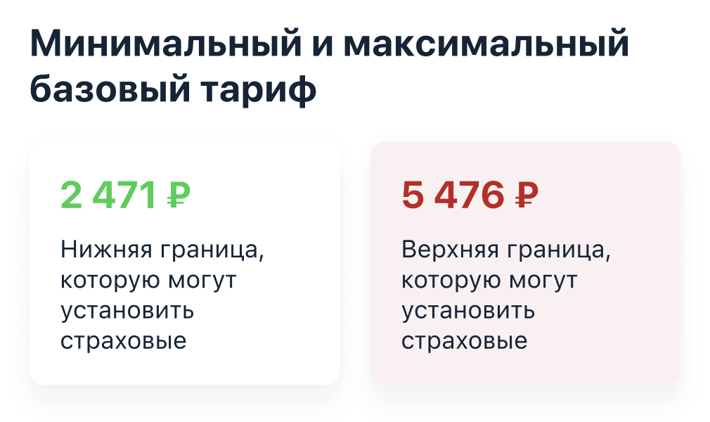
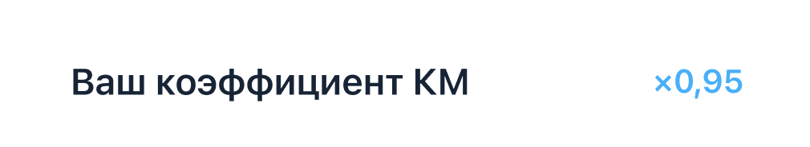
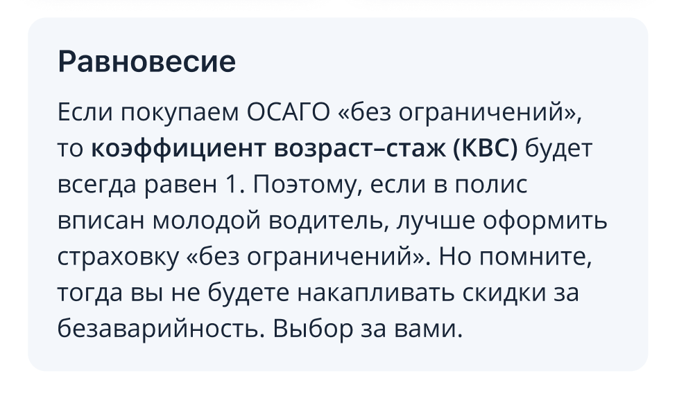

# Выполненное задание Sravni.ru

## Требования
* Язык программирования Swift;
* Архитектура экрана на VIPER;
* Верстка кодом, не используя storyboards;
* Иконки в PDF;
* Учесть ширину экранов на разных разрешениях;

## Задача
Необходимо реализовать один из экранов калькулятора ОСАГО.

## Задание: Информационный экран с тарифами

* Создать модуль VIPER для страницы;
* Сделать mock данных и реализовать загрузку данных в модели;
---

### Реализован header с картинкой и title

---
### Реализована ячейка статичного текста

---
### Реализована ячейка для списка с буллитами

---
### Реализована ячейка с тарифом

---

### Реализована ячейка выбора коэффициента

---

### Реализована ячейка "Ваш коэффициент"

---

### Реализована ячейка "Равновесие"

---
### Реализована ячейка "вернуться на главную"

---

### На основе сверстанных ячеек реализован один общий экран, для шести наборов данных
     

* Реализовано обновление данных после выбора коэффициента;

В папке App -> AppSettings -> SetupAppRouter в инициализации AppRouter(nameInformation: ,appViewController: , fetchService: , editFetchService: ), в nameInformation из массива arrayNameInformation выбирается экран, который будем тестить.
